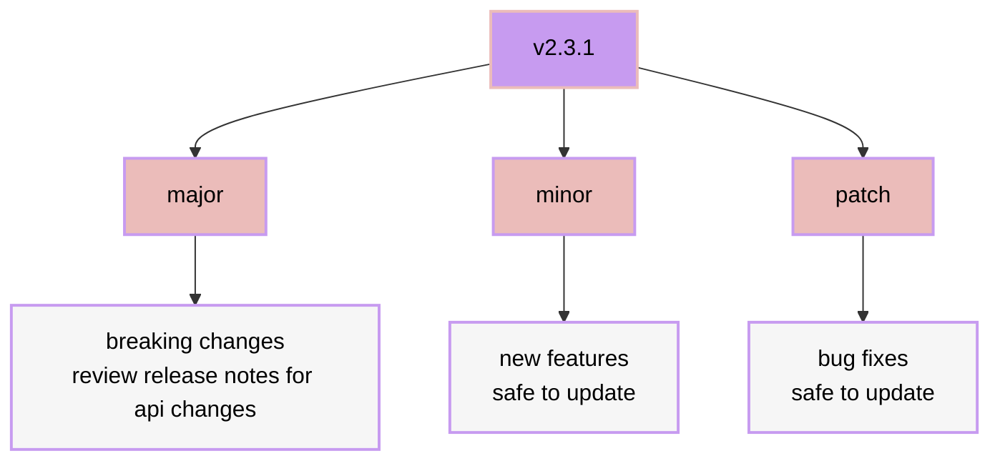

# upgrading

hydenix can be upgraded, downgraded, or version locked easy.
in your template flake folder, update hydenix to main using:

```bash
nix flake update hydenix
```

or define a specific version in your `flake.nix` template:

```nix
inputs = {
    nixpkgs.url = "github:nixos/nixpkgs/nixos-unstable";
    hydenix = {
      # Available inputs:
      # Main: github:richen604/hydenix
      # Dev: github:richen604/hydenix/dev
      # Commit: github:richen604/hydenix/<commit-hash>
      # Version: github:richen604/hydenix/v1.0.0
      url = "github:richen604/hydenix";
    };
  };
```

run `nix flake update hydenix` again to load the update, then rebuild your system to apply the changes.

## when to upgrade



<br>

> [!Important]
>
> - **always review [release notes](https://github.com/richen604/hydenix/releases) for major updates (API changes)**
> - update to minor versions for new features
> - keep up with patches for stability
