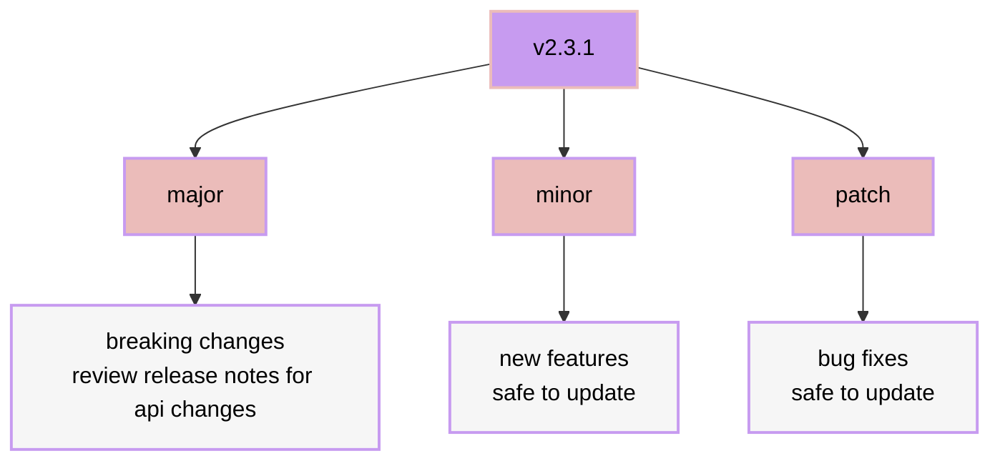

# faq

## general FAQ

- [faq](#faq)
  - [general FAQ](#general-faq)
    - [why should I use nixos?](#why-should-i-use-nixos)
    - [how do I learn more about nix?](#how-do-i-learn-more-about-nix)
  - [hydenix FAQ](#hydenix-faq)
    - [how do I upgrade hydenix?](#how-do-i-upgrade-hydenix)
    - [when should I upgrade?](#when-should-i-upgrade)
    - [how do I fix (nix error / system error / bug / etc)?](#how-do-i-fix-nix-error--system-error--bug--etc)
    - [common errors](#common-errors)
      - [`Existing file '...' is in the way of '...'`](#existing-file--is-in-the-way-of-)
    - [what are the module options?](#what-are-the-module-options)
    - [what if I want to customize hydenix?](#what-if-i-want-to-customize-hydenix)
    - [what are some example configurations?](#what-are-some-example-configurations)
    - [how do I persist changes on reboot/rebuild/etc?](#how-do-i-persist-changes-on-rebootrebuildetc)
    - [how do I add a new theme?](#how-do-i-add-a-new-theme)
    - [what is mutable.nix?](#what-is-mutablenix)
    - [why do themes still show after I remove them from `hydenix.hm.theme.themes`?](#why-do-themes-still-show-after-i-remove-them-from-hydenixhmthemethemes)
    - [requesting features](#requesting-features)
  - [other faq](#other-faq)
    - [how do I run hyprland in a vm?](#how-do-i-run-hyprland-in-a-vm)

### why should I use nixos?

nixos offers several key advantages:

1. **reproducible setups**: roll back to working states instantly if something breaks.
2. **configuration as code**: version control your entire OS setup.
3. **no dependency hell**: packages are isolated, allowing multiple versions side by side.
4. **declarative approach**: describe the desired end state rather than steps to achieve it.
5. **risk-free experimentation**: test configurations without permanent consequences.
6. **developer-friendly**: create isolated environments with precise dependencies.

there's a learning curve, but the benefits are worth it.

<div align="right">
  <a href="#faq">
    
  </a>
</div>

### how do I learn more about nix?

> [!TIP]
> nix is a powerful package manager and configuration system that can be overwhelming at first. here are some resources to help you get started:

general resources

- [nix packages](https://search.nixos.org/packages)
- [nix options](https://search.nixos.org/options)
- [home manager options](https://home-manager-options.extranix.com/?query=&release=master)
- [nixos wiki](https://nixos.wiki)
- [nixpkgs discussions](https://discourse.nixos.org)
- [nixpkgs issues](https://github.com/NixOS/nixpkgs/issues)

<div align="right">
  <a href="#faq">
    
  </a>
</div>

## hydenix FAQ

### how do I upgrade hydenix?

hydenix can be upgraded, downgraded, or version locked easy.
in your template flake folder, update hydenix to main using

```bash
nix flake update hydenix
```

or define a specific version in your `flake.nix` template

```nix
inputs = {
    nixpkgs.url = "github:nixos/nixpkgs/nixos-unstable";
    hydenix = {
      # Available inputs:
      # Main: github:richen604/hydenix
      # Dev: github:richen604/hydenix/dev
      # Commit: github:richen604/hydenix/<commit-hash>
      # Version: github:richen604/hydenix/v1.0.0
      url = "github:richen604/hydenix";
    };
  };
```

run `nix flake update hydenix` again to load the update, then rebuild your system to apply the changes

### when should I upgrade?



- **always review [release notes](https://github.com/richen604/hydenix/releases) for major updates (api changes)**
- keep up with patches for stability
- update to minor versions for new features

### how do I fix (nix error / system error / bug / etc)?

please see the [troubleshooting](./troubleshooting.md) guide for more information on how to diagnose and fix issues.
or create an issue in the [hydenix GitHub repository](https://github.com/richen604/hydenix/issues).

### common errors

#### `Existing file '...' is in the way of '...'`

this error occurs when home-manager tries to manage a file that already exists and wasn't created by home-manager.

example:

```bash
Existing file '/home/user/.config/kitty/kitty.conf' is in the way of '/nix/store/...-home-manager-files/.config/kitty/kitty.conf'
```

**solution 1: remove existing files (recommended)**

remove the conflicting files and let home-manager recreate them:

```bash
# Remove the specific file
rm ~/.config/kitty/kitty.conf

# Or remove entire config directory if needed (careful not to delete important files)
rm -rf ~/.config/kitty/
```

**solution 2: backup existing files**

if you want to preserve your existing configuration:

```bash
# Create backup
mv ~/.config/kitty/kitty.conf ~/.config/kitty/kitty.conf.backup

# Then rebuild to let home-manager create the new file
sudo nixos-rebuild switch
```

**solution 3: force home-manager to backup automatically**

add this to your `configuration.nix` to automatically backup conflicting files:

```nix
{
  home-manager.backupFileExtension = "backup";
}
```

this will automatically rename existing files with a `.backup` extension when home-manager encounters conflicts, allowing the rebuild to proceed without manual intervention only once.

> [!WARNING]
> if there is a conflict again, home-manager will error for you to manually resolve it. i don't include this by default as automating backups may not be ideal for users and it does not really solve the issue with managing backups

### what are the module options?

Visit [options.md](./options.md) for more information on the module options.

### what if I want to customize hydenix?

hydenix is designed to be customizable outside of the module options. write your own modules, import your own flakes, packages, etc.

if you need to disable any of the modules above in [module options](#what-are-the-module-options), simply disable the module and write your own configuration. ideally referencing the module in the source code.

note however, it's very easy to overwrite hydenix defaults this way and may lead to bugs. feel free to ask questions in our [discord](https://discord.gg/AYbJ9MJez7) if you need help.

<div align="right">
  <a href="#faq">
    
  </a>
</div>

### what are some example configurations?

see [community configs](./community.md) for examples.

### how do I persist changes on reboot/rebuild/etc?

> [!IMPORTANT]
> do not edit any mutable files at runtime as they may be overwritten on rebuild <br>
> all edits must be done in your flake via nixos & home-manager options

some state files in hydenix are mutable by design. this allows certain theme changes during runtime.

example:

lets say you have the default theme set to `Catppuccin Mocha` in `hydenix.hm.theme.active`.

you change a theme during runtime using `Meta + Shift + T` to `Catppuccin Latte`.
your config is unchanged so when you reboot/relog/rebuild, the theme will revert to `Catppuccin Mocha`.

```nix
{
  hydenix.hm.theme.active = "Catppuccin Mocha";
}
```

simply change the theme in your config to match your desired theme and rebuild.

```nix
{
  hydenix.hm.theme.active = "Catppuccin Latte";
}
```

but what about file you want to stop from reverting? waybar position or kitty config?
home-managers `home.file` allows you to do this

```nix
# any file in `./modules/hm/`
{
  home.file = {
    # copy kitty config to your template flake
    # cp ~/.config/kitty/kitty.conf ~/path/to/flake/kitty.conf
    ".config/kitty/kitty.conf" = {
      source = ./kitty.conf; # path to your kitty config in your template flake
    };
    # copy waybar position state to your template flake
    # cp ~/.config/waybar/config.ctl ~/path/to/flake/config.ctl
    ".config/waybar/config.ctl" = {
      source = ./config.ctl; # path to your waybar config in your template flake
    };
  };
}
```

see [home.file options](https://home-manager-options.extranix.com/?query=home.file&release=master) for more information

<div align="right">
  <a href="#faq">
    
  </a>
</div>

### how do I add a new theme?

<!-- TODO: docs: Add a guide on how to add a new theme -->

### what is mutable.nix?

> [!IMPORTANT]
> do not edit any mutable files at runtime as they may be overwritten on rebuild <br>
> all edits must be done in your flake via nixos & home-manager options

`mutable.nix` is a custom module that allows certain files to be copied instead of symlinked during system builds, making them writable at runtime. key points:

- extends `home.file`, `xdg.configFile`, and `xdg.dataFile` with a `mutable` option
- files marked as `mutable = true` (and `force = true`) will be writable
- changes persist across rebuilds
- useful for programs that need runtime configuration changes

example usage in scripts:

```nix
home.activation = {
    example = lib.hm.dag.entryAfter [ "mutableGeneration" ] ''
        $DRY_RUN_CMD echo "example"
    '';
}
```

credit: [@piousdeer](https://gist.github.com/piousdeer/b29c272eaeba398b864da6abf6cb5daa)

<div align="right">
  <a href="#faq">
    
  </a>
</div>

### why do themes still show after I remove them from `hydenix.hm.theme.themes`?

themes are saved in `~/.config/hydenix/themes` so they will still show after you remove them from `hydenix.hm.theme.themes`.
to clear the saved themes, run `rm -rf ~/.config/hydenix/themes/THEME_NAME` for each theme you want to remove.

<div align="right">
  <a href="#faq">
    
  </a>
</div>

### requesting features

please open a [feature request](https://github.com/richen604/hydenix/issues/new?template=feature_request.md) if you have any feature requests.

<div align="right">
  <a href="#faq">
    
  </a>
</div>

## other faq

### how do I run hyprland in a vm?

hyprland vm is not well supported. check out [hyprland - running in a vm](https://wiki.hyprland.org/Getting-Started/Installation/#running-in-a-vm)

best bet is to have virtio, opengl, and VT-x support

non-nixos hosts should run with [nixGL](https://github.com/nix-community/nixGL) eg `nixGL nix run .`

<details>
<summary>hardware requirements</summary>
CPU

- Intel CPU with VT-x or AMD CPU with AMD-V
- Virtualization enabled in BIOS/UEFI

GPU

- NVIDIA: GTX 600+ series (proprietary drivers)
- AMD: HD 7000+ series
- Intel: HD 4000+ (Ivy Bridge)
- OpenGL 3.3+ support required

</details>

<br>

<details>
<summary>1. install drivers</summary>

```bash
# Nvidia
sudo apt install nvidia-driver nvidia-utils     # Debian/Ubuntu
sudo pacman -S nvidia nvidia-utils              # Arch
# NixOS configuration
{
  hardware.graphics.enable = true;
  hardware.nvidia.package = config.boot.kernelPackages.nvidiaPackages.stable;
  hardware.nvidia.modesetting.enable = true;
}

# AMD
sudo apt install mesa-utils vulkan-tools        # Debian/Ubuntu
sudo pacman -S mesa lib32-mesa vulkan-radeon    # Arch
# NixOS configuration
{
  hardware.graphics.enable = true;
  hardware.graphics.extraPackages = with pkgs; [ amdvlk ];
}

# Intel
sudo apt install mesa-utils intel-media-va-driver  # Debian/Ubuntu
sudo pacman -S mesa lib32-mesa intel-media-driver  # Arch
# NixOS configuration
{
  hardware.graphics.enable = true;
  hardware.graphics.extraPackages = with pkgs; [ intel-media-driver ];
}

# KVM modprobe
modprobe kvm
modprobe kvm_intel # or kvm_amd
# NixOS configuration
{
  boot.kernelModules = [ "kvm-intel" ]; # or "kvm-amd" for AMD processors
  virtualisation.libvirtd.enable = true;
}
```

</details>

<div style="margin-top: 10px;"></div>

<details>
<summary>2. verify setup</summary>

```bash
# Verify KVM support
egrep -c '(vmx|svm)' /proc/cpuinfo    # Should return > 0
lsmod | grep kvm                       # Check KVM modules

# Host: Check OpenGL
glxinfo | grep "OpenGL"
```

</details>

<div style="margin-top: 10px;"></div>

<details>
<summary>3. setup the vm</summary>

to set up the vm, follow the instructions in the [hyprland - running in a vm](https://wiki.hyprland.org/Getting-Started/Installation/#running-in-a-vm) guide.

additionally, the following qemu options have been found to be successful:

```bash
-device virtio-vga-gl
-display gtk,gl=on,grab-on-hover=on
-usb -device usb-tablet
-cpu host
-enable-kvm
-machine q35
-device intel-iommu
-device ich9-intel-hda
-device hda-output
-vga none
```

</details>

<div align="right">
  <a href="#faq">
    
  </a>
</div>
